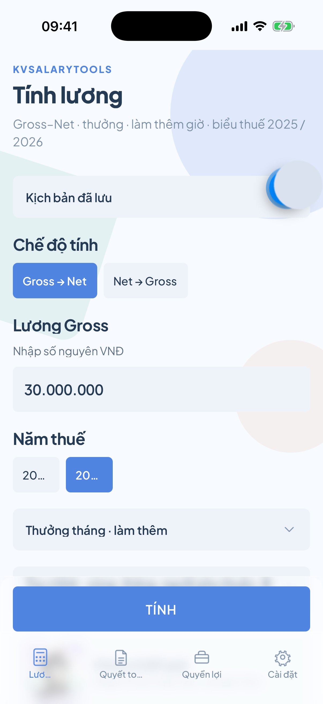
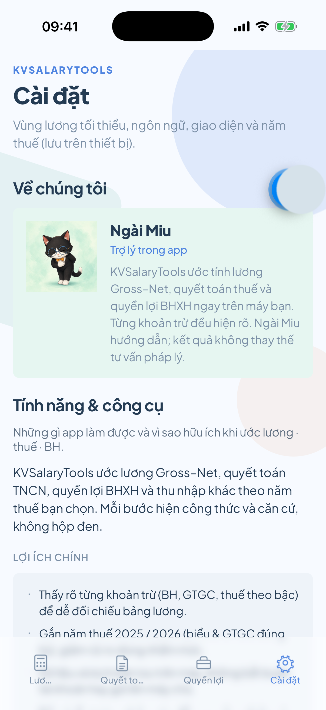
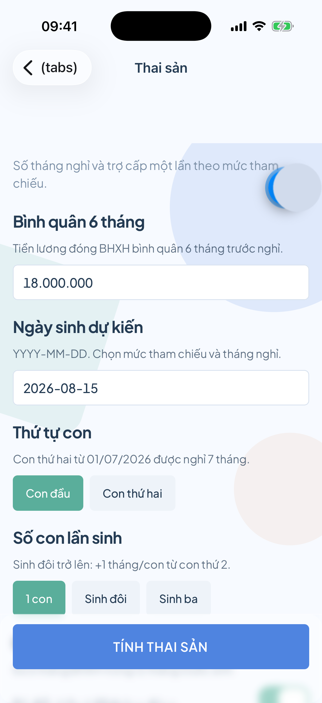
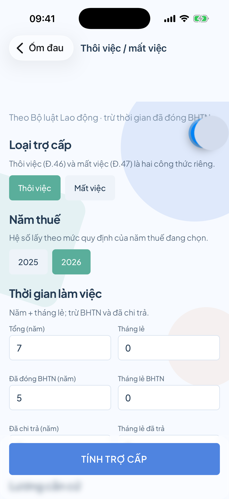
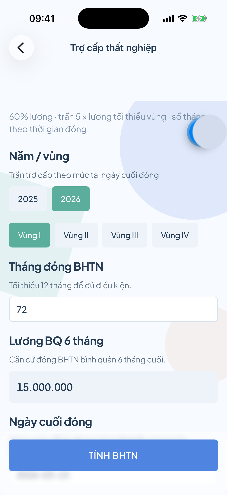
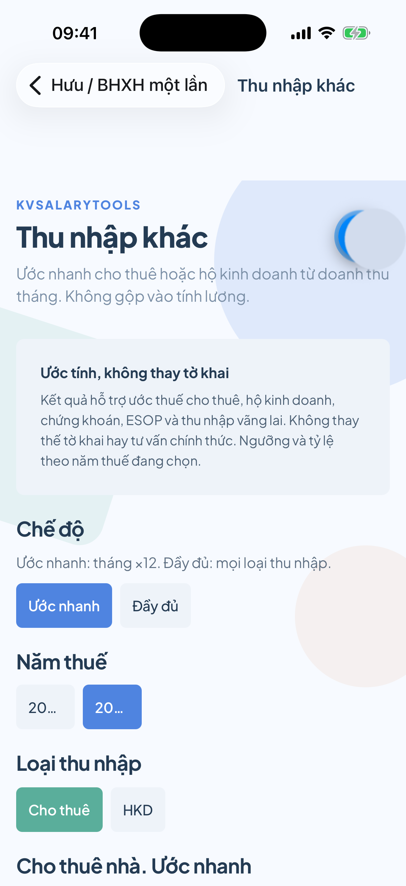

# KVSalaryTools

[](LICENSE)
[](https://expo.dev/)
[](https://reactnative.dev/)

Ước tính **lương Gross ↔ Net**, **thuế TNCN**, **bảo hiểm** và **quyền lợi BHXH** ngay trên thiết bị. Tính offline, tách rõ từng khoản trừ, có công thức và căn cứ pháp lý. Trợ lý **Ngài Miu** hướng dẫn trong app.

> Kết quả chỉ mang tính tham khảo. Không thay thế tư vấn pháp lý, kế toán hay quyết định của cơ quan thuế / BHXH.

## Tính năng

| Nhóm | Công cụ |
|------|---------|
| **Lương** | Gross ↔ Net, thưởng, làm thêm giờ, GTGC / NPT, so sánh biểu 2025 / 2026, lưu kịch bản |
| **Quyết toán** | Ước hoàn / nộp thêm, wizard hướng dẫn nộp, banner mùa vụ |
| **Quyền lợi** | Thai sản, ốm đau, hưu / BHXH một lần, thôi việc, thất nghiệp |
| **Thu nhập khác** | Cho thuê, hộ kinh doanh, chứng khoán, ESOP, vãng lai |
| **Trải nghiệm** | Dark mode (Sáng / Tối / Hệ thống), 7 ngôn ngữ, tips có công thức, cập nhật mức thuế · BH |

## Ảnh chụp màn hình

Chụp trên iOS Simulator (iPhone), đã loại overlay Expo / Dev Tools.

<p align="center">
  
  
  
  
</p>

<p align="center">
  
  
  
  
  
</p>

<p align="center">
  
  
  
</p>

| File | Màn hình |
|------|----------|
| [`01-calculator.png`](docs/screenshots/01-calculator.png) | Tính lương Gross ↔ Net |
| [`03-settlement.png`](docs/screenshots/03-settlement.png) | Quyết toán năm |
| [`04-benefits-hub.png`](docs/screenshots/04-benefits-hub.png) | Hub quyền lợi |
| [`05-maternity.png`](docs/screenshots/05-maternity.png) | Thai sản |
| [`06-settings.png`](docs/screenshots/06-settings.png) | Cài đặt · giới thiệu tính năng |
| [`07-sick-leave.png`](docs/screenshots/07-sick-leave.png) | Ốm đau |
| [`08-severance.png`](docs/screenshots/08-severance.png) | Thôi việc / mất việc |
| [`09-unemployment.png`](docs/screenshots/09-unemployment.png) | Trợ cấp thất nghiệp |
| [`10-retirement.png`](docs/screenshots/10-retirement.png) | Hưu / BHXH một lần |
| [`11-other-income.png`](docs/screenshots/11-other-income.png) | Thu nhập khác |
| [`12-comparison.png`](docs/screenshots/12-comparison.png) | So sánh 2025 vs 2026 |
| [`13-filing-wizard.png`](docs/screenshots/13-filing-wizard.png) | Hướng dẫn quyết toán |

## Yêu cầu

- Node.js 20+ (khuyến nghị LTS)
- npm 10+
- [Expo Go](https://expo.dev/go) hoặc Xcode Simulator / Android Emulator

## Cài đặt & chạy

```bash
cd kvsalarytools
npm install
npx expo start
```

Mở trên iOS Simulator:

```bash
npx expo start --ios
```

Android:

```bash
npx expo start --android
```

## Kiểm thử

```bash
npm test            # smoke engine
npm run test:unit   # unit tests (Jest)
npm run qa:design   # kiểm tra token / Flat Design hygiene
```

## Cấu trúc thư mục

```
app/                 # Expo Router screens
src/
  components/        # UI (glass, tips, breakdown…)
  engine/            # Tính toán offline + ruleset
  i18n/              # Đa ngôn ngữ + tips
  theme/             # Tokens, light/dark palettes
  store/             # Preferences, scenarios (AsyncStorage)
docs/                # Domain, product, store listing
specs/               # Feature specs
docs/screenshots/    # Ảnh chụp README
```

## Tài liệu

| Mục | Link |
|-----|------|
| Phạm vi sản phẩm | [docs/product/scope.md](docs/product/scope.md) |
| Design system | [docs/product/design-system.md](docs/product/design-system.md) |
| Nghiệp vụ | [docs/domain/](docs/domain/) |
| Spec tính năng | [specs/](specs/) |
| Store listing | [docs/store/README.md](docs/store/README.md) |
| Constitution | [.specify/memory/constitution.md](.specify/memory/constitution.md) |

## Chụp lại ảnh (Simulator, không Dev Tools)

```bash
# Metro production giúp giảm overlay; cần Expo Go + Simulator đã boot
npx expo start --ios --no-dev --minify

# Batch capture + scrub nút Expo FAB (bánh răng xanh)
bash scripts/capture-screenshots.sh
```

Hoặc thủ công: deep link `exp://127.0.0.1:8081/--/<route>` rồi
`xcrun simctl io booted screenshot …` và `python3 scripts/scrub-expo-fab.py <in> <out>`.

Routes: `(tabs)`, `settlement`, `benefits`, `settings`, `maternity`, `sick-leave`, `severance`, `unemployment`, `retirement`, `other-income`, `comparison`, `filing-wizard`.

## Tác giả

**Phạm Huy Đức** · [kataro92@gmail.com](mailto:kataro92@gmail.com)

## Giấy phép

Phát hành theo giấy phép [MIT](LICENSE).
