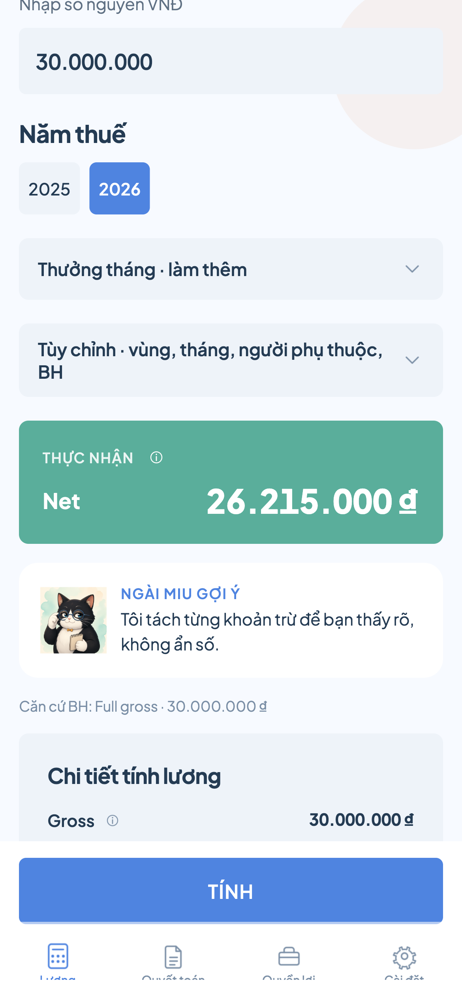
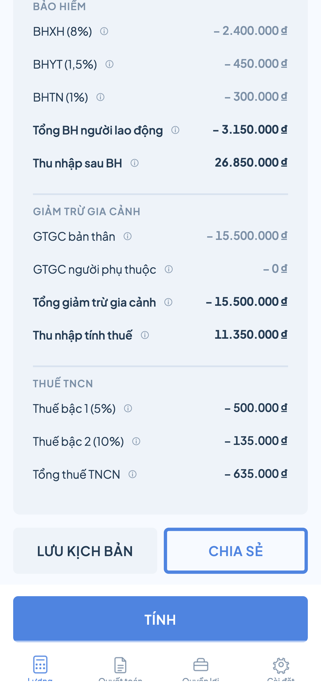
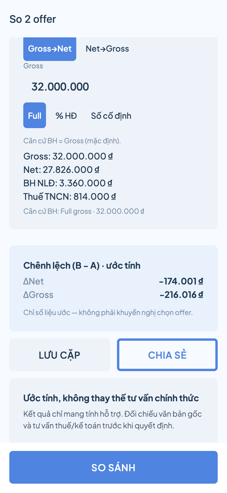
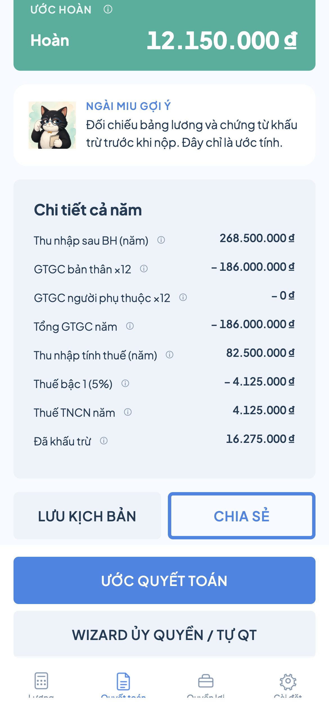
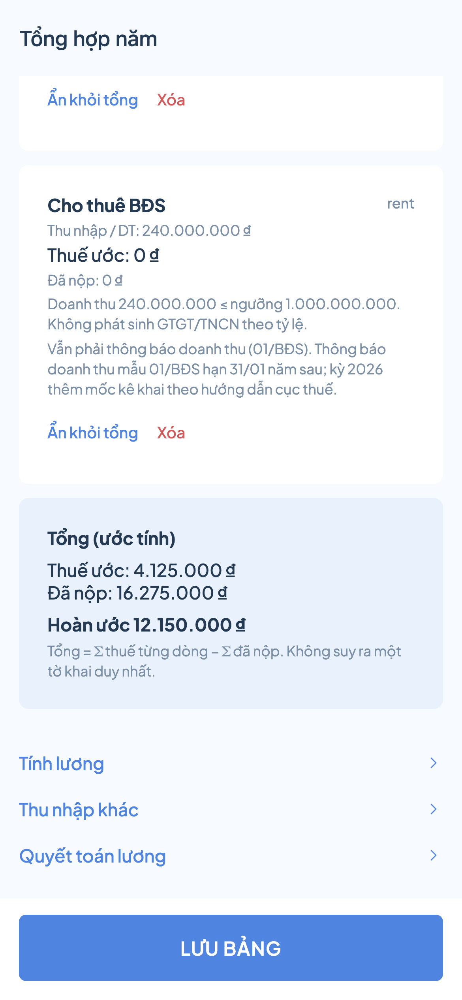
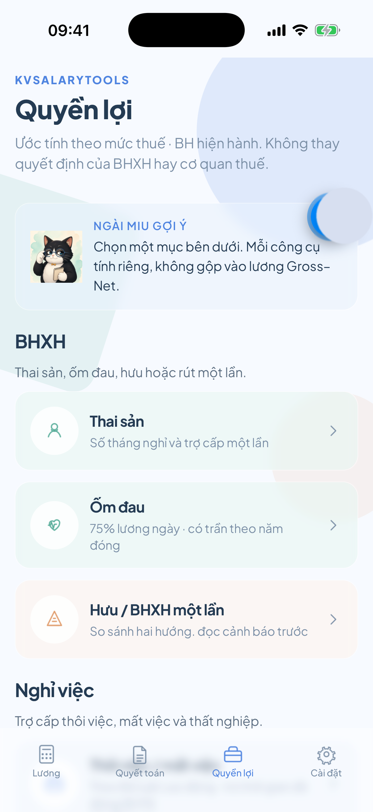
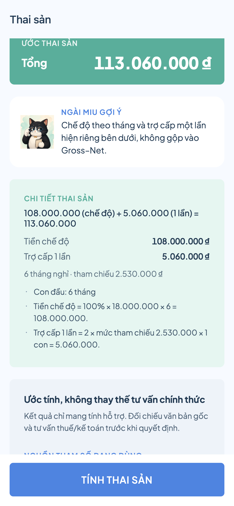
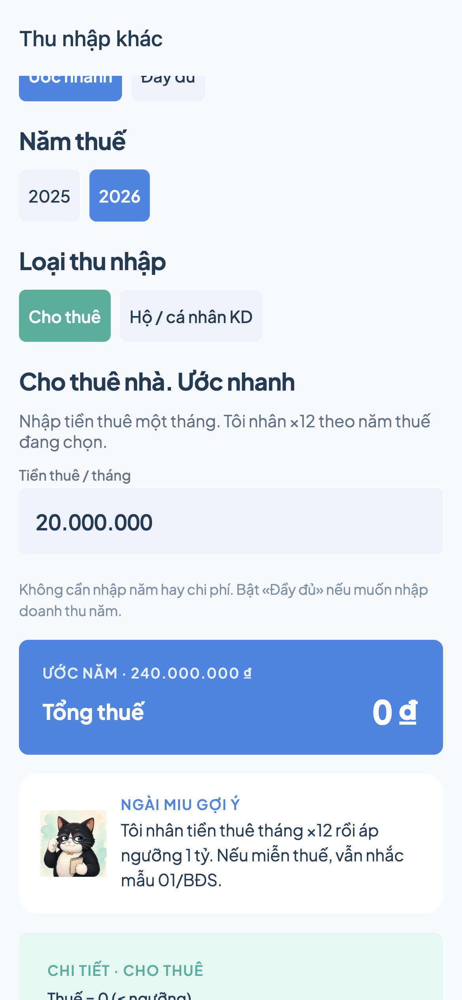

# KSalaryInsights

[](LICENSE)
[](https://expo.dev/)
[](https://reactnative.dev/)

Ước tính **lương Gross ↔ Net**, **thuế TNCN**, **bảo hiểm** và **quyền lợi BHXH** ngay trên thiết bị. Tính offline, tách rõ từng khoản trừ, có công thức và căn cứ pháp lý. Trợ lý **Ngài Miu** hướng dẫn trong app.

> Kết quả chỉ mang tính tham khảo. Không thay thế tư vấn pháp lý, kế toán hay quyết định của cơ quan thuế / BHXH.

## Dành cho ai?

App hữu ích khi bạn gặp các tình huống sau:

| Tình huống | App giúp gì |
|------------|-------------|
| **So sánh offer Gross / Net** | Nhà tuyển dụng lúc nói Gross, lúc nói Net; đóng BH theo lương cơ bản, một phần hoặc full. Offer 28tr Net và 32tr Gross không so được nếu chưa quy cùng một mặt — đổi Gross ↔ Net, chỉnh mức BH (full / % HĐ / cố định), hoặc mở **So 2 offer**. |
| **Bảng lương thấp hơn mức đã nghe** | Công ty báo cao, cuối tháng nhận ít hơn mà không rõ trừ vì BH, GTGC hay thuế. Tính lại, tách từng dòng, đối chiếu phiếu lương; lưu kịch bản để lần chuyển việc sau rõ hơn. |
| **Mức BH · thuế đổi hàng năm** | Trần BH, GTGC, biểu thuế đổi theo năm (vd. 2025 → 2026). Không cần nghiệp vụ kế toán: chọn năm thuế, xem chênh Net / thuế để tự kiểm chứng mức công ty áp dụng. |
| **Trước mùa quyết toán** | Ước hoàn / nộp thêm so với đã khấu trừ; wizard gợi ý ủy quyền công ty hay tự nộp. |
| **Nghỉ việc, thai sản, thất nghiệp…** | Ước trợ cấp thôi việc, thất nghiệp, thai sản, ốm đau; so hưu với BHXH một lần — mỗi công cụ có điều kiện và trần. |
| **Thu nhập ngoài lương** | Cho thuê, hộ KD / freelancer, chứng khoán, ESOP, vãng lai: ước GTGT / TNCN tách dòng. **Không** ước thuế coin / tài sản mã hóa. |
| **Tổng hợp QT đa nguồn** | Một bảng năm: lương + các nguồn đã ước → tổng thuế / đã nộp / chênh (không nộp tờ khai). |

## Tính năng

| Nhóm | Công cụ |
|------|---------|
| **Lương** | Gross ↔ Net, preset mức BH (full / % / cố định), thưởng, OT, GTGC / NPT, so sánh biểu 2025 / 2026, **So 2 offer**, lưu kịch bản |
| **Quyết toán** | Ước hoàn / nộp thêm, **tổng hợp QT đa nguồn**, wizard hướng dẫn nộp, banner mùa vụ |
| **Quyền lợi** | Thai sản, ốm đau, hưu / BHXH một lần, thôi việc, thất nghiệp |
| **Thu nhập khác** | Cho thuê, hộ / cá nhân KD, chứng khoán, ESOP, vãng lai (không ước coin) |
| **Trải nghiệm** | Dark mode (Sáng / Tối / Hệ thống), 7 ngôn ngữ, tips có công thức, cập nhật mức thuế · BH |

## Ảnh chụp màn hình

Gallery theo **câu chuyện sản phẩm** (có kết quả ước, không chỉ form trống). Chụp viewport iPhone + Simulator; overlay Dev Tools đã loại bỏ khi capture native.

### 1 · Lương Gross → Net (tách khoản trừ)

<p align="center">
  
  
</p>

### 2 · So 2 offer & quyết toán năm

<p align="center">
  
  
  
</p>

### 3 · Quyền lợi · thu nhập khác · cài đặt

<p align="center">
  
  
  
  
</p>

| File | Bạn thấy gì |
|------|-------------|
| [`01-calculator-net.png`](docs/screenshots/01-calculator-net.png) | Gross 30tr → **Net 26,215,000 ₫** + căn cứ BH |
| [`02-calculator-breakdown.png`](docs/screenshots/02-calculator-breakdown.png) | BHXH/BHYT/BHTN, GTGC, thuế theo bậc |
| [`03-offer-compare.png`](docs/screenshots/03-offer-compare.png) | Net 28tr vs Gross 32tr → **ΔNet / ΔGross** |
| [`04-settlement-refund.png`](docs/screenshots/04-settlement-refund.png) | QT năm: **ước hoàn** vs đã khấu trừ |
| [`05-multi-source.png`](docs/screenshots/05-multi-source.png) | Tổng hợp lương + cho thuê → tổng thuế / đã nộp |
| [`06-benefits-hub.png`](docs/screenshots/06-benefits-hub.png) | Thai sản, ốm đau, hưu, thôi việc, thất nghiệp |
| [`07-maternity.png`](docs/screenshots/07-maternity.png) | Ước chế độ thai sản + trợ cấp một lần |
| [`08-other-income.png`](docs/screenshots/08-other-income.png) | Cho thuê dưới ngưỡng: thuế 0 + nhắc kê khai |
| [`09-settings.png`](docs/screenshots/09-settings.png) | Giới thiệu tính năng, ngôn ngữ, giao diện |

## Yêu cầu

- Node.js 20+ (khuyến nghị LTS)
- npm 10+
- [Expo Go](https://expo.dev/go) hoặc Xcode Simulator / Android Emulator

## Cài đặt & chạy

```bash
cd ksalaryinsights
npm install
npx expo start
# hoặc: npm start
```

Mở trên iOS Simulator:

```bash
npx expo start --ios
```

Android:

```bash
npx expo start --android
```

### Release / production Metro

Chạy bundler ở chế độ release (`--no-dev --minify`) — gần store build hơn, ít overlay Dev Tools; hữu ích khi chụp screenshot hoặc kiểm tra performance:

```bash
npm run start:release
# tương đương: npx expo start --no-dev --minify
```

iOS / Android với cùng cấu hình:

```bash
npm run ios:release      # npx expo start --ios --no-dev --minify
npm run android:release  # npx expo start --android --no-dev --minify
```

Native rebuild (dev client / prebuild đã có `ios/`):

```bash
npm run ios
npm run android
```
## Kiểm thử

```bash
npm test            # smoke engine
npm run test:unit   # unit tests (Jest)
npm run qa:design   # kiểm tra token / Flat Design hygiene
```

## Cấu trúc thư mục

```
app/                 # Expo Router screens
src/
  components/        # UI (glass, tips, breakdown…)
  engine/            # Tính toán offline + ruleset
  i18n/              # Đa ngôn ngữ + tips
  theme/             # Tokens, light/dark palettes
  store/             # Preferences, scenarios (AsyncStorage)
docs/                # Domain, product, store listing
specs/               # Feature specs
docs/screenshots/    # Ảnh chụp README
```

## Tài liệu

| Mục | Link |
|-----|------|
| Phạm vi sản phẩm | [docs/product/scope.md](docs/product/scope.md) |
| Design system | [docs/product/design-system.md](docs/product/design-system.md) |
| Nghiệp vụ | [docs/domain/](docs/domain/) |
| Spec tính năng | [specs/](specs/) |
| Store listing | [docs/store/README.md](docs/store/README.md) |
| Constitution | [.specify/memory/constitution.md](.specify/memory/constitution.md) |

## Chụp lại ảnh (có kết quả, ít Dev Tools)

```bash
# Metro release — giảm overlay; Simulator hoặc thiết bị thật đã boot
npm run ios:release
# hoặc web mobile viewport: npx expo start --web

# Batch route capture (form trống — dùng làm nền; nên bấm Tính trước khi chụp tay)
bash scripts/capture-screenshots.sh
```

Ưu tiên chụp **sau khi đã tính** (Net hero, ΔNet, ước hoàn, tổng hợp đa nguồn…) rồi đặt file vào [`docs/screenshots/`](docs/screenshots/) theo bảng trên. Xem [`docs/screenshots/README.md`](docs/screenshots/README.md).

Hoặc thủ công: deep link `exp://127.0.0.1:8081/--/<route>` rồi
`xcrun simctl io booted screenshot …` và `python3 scripts/scrub-expo-fab.py <in> <out>`.

Routes: `(tabs)`, `settlement`, `benefits`, `settings`, `maternity`, `sick-leave`, `severance`, `unemployment`, `retirement`, `other-income`, `comparison`, `filing-wizard`, `offer-compare`, `multi-source`.
## Tác giả

**Phạm Huy Đức** · [kataro92@gmail.com](mailto:kataro92@gmail.com)

## Giấy phép

Phát hành theo giấy phép [MIT](LICENSE).
