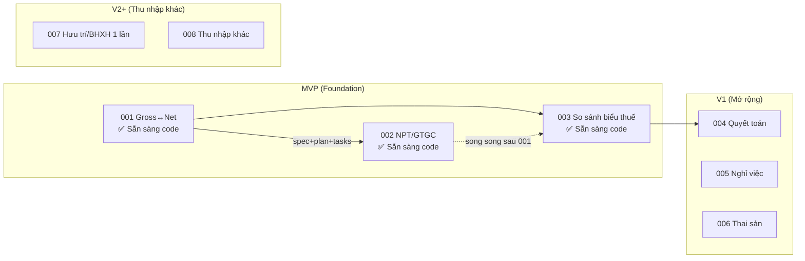

# 📋 Báo cáo Review Toàn bộ Tài liệu Dự án KVSalaryTools

> **Ngày review**: 2026-08-03  
> **Remediation**: 2026-08-05 — **Đợt 1–3 đã đóng** (xem mục trạng thái cuối báo cáo)  
> **Phạm vi**: Toàn bộ ~45 file tài liệu trong `docs/`, `specs/`, `.specify/`, `README.md`  
> **Phương pháp**: 4 subagent song song review độc lập + tổng hợp chéo

---

## 📊 Tổng quan Đánh giá

| Nhóm tài liệu | Số file | Chất lượng chung | Độ chính xác pháp lý |
|---|:---:|:---:|:---:|
| **Domain** (nghiệp vụ pháp lý) | 8 | ⭐⭐⭐⭐⭐ Xuất sắc | ✅ 100% Tầng 1, toán học chính xác |
| **Specs** (đặc tả tính năng) | 8 dirs (16 files) | ⭐⭐⭐⭐ Rất tốt | ✅ Cập nhật luật 2025–2026 |
| **Product** (sản phẩm) | 6 | ⭐⭐⭐⭐ Tốt | ⚠️ Có xung đột data contract |
| **Research** (nghiên cứu) | 5 | ⭐⭐⭐⭐ Tốt | N/A |
| **ADRs** (quyết định kiến trúc) | 5 | ⭐⭐⭐ Khá | N/A |
| **Core** (README, constitution) | 6 | ⭐⭐⭐ Khá | N/A |

> [!TIP]
> **Điểm mạnh nổi bật**: Bộ tài liệu nghiệp vụ pháp lý đạt chất lượng **cực kỳ cao** — 100% văn bản đã xác minh Tầng 1, tất cả 20+ test case tính tay đều chính xác tuyệt đối, các thông số dùng chung (lương cơ sở, GTGC, LTTV, tỷ lệ BH) **đồng nhất 100%** trên toàn bộ 8 file domain.

---

## 🔴 LỖI NGHIÊM TRỌNG — Cần sửa ngay (3 lỗi)

### 1. Sai lệch thuật ngữ pháp lý trong Glossary
- **File**: [`glossary.md`](file:///d:/Projects/KVSalaryTools/docs/domain/glossary.md)
- **Vấn đề**: Định nghĩa "Thu nhập chịu thuế" sai — ghi BH bắt buộc là khoản trừ khỏi Gross để ra "Thu nhập chịu thuế". Theo Luật Thuế TNCN (Đ.7–8), BH bắt buộc là **khoản giảm trừ** để tính ra "Thu nhập tính thuế" (TNTT).
- **Công thức đúng**:
  ```
  Thu nhập chịu thuế = Gross − Phụ cấp miễn thuế
  TNTT = Thu nhập chịu thuế − (BH bắt buộc + GTGC + Từ thiện + ...)
  ```
- **Hành động**: Sửa lại dòng 9–10 trong `glossary.md`

### 2. Mâu thuẫn nội bộ về Điều khoản NĐ 68/2026
- **File**: [`thu-nhap-khac.md`](file:///d:/Projects/KVSalaryTools/docs/domain/thu-nhap-khac.md)
- **Vấn đề**: Dòng 66 ghi "Đ.5 NĐ 68" (đúng), nhưng dòng 82 lại ghi "Điều 4 NĐ 68/2026" (sai) — mâu thuẫn trực tiếp ngay trong cùng file
- **Hành động**: Sửa dòng 82 từ "Điều 4" → "Điều 5"

### 3. Xung đột Data Contract giữa rules-versioning và ruleset-spec/schema
- **File**: [`rules-versioning.md`](file:///d:/Projects/KVSalaryTools/docs/product/rules-versioning.md) vs [`ruleset-spec.md`](file:///d:/Projects/KVSalaryTools/docs/product/ruleset-spec.md) & [`ruleset-schema.json`](file:///d:/Projects/KVSalaryTools/docs/product/ruleset-schema.json)
- **Vấn đề**: JSON mẫu trong `rules-versioning.md` dùng cấu trúc cũ hoàn toàn lệch với spec/schema:

| Thuộc tính | `rules-versioning.md` (CŨ) | `ruleset-spec.md` / schema (MỚI) |
|---|---|---|
| Lương tham chiếu | `reference_wage` | `reference_salary` |
| Vùng lương tối thiểu | `region_min_wages` (key `"I","II"`) | `regional_minimum_wages` (key `"1","2"`) |
| Biểu thuế | `tax_brackets_monthly` + `up_to` | `pit_brackets` + `max_taxable_income` |
| Tỷ lệ BH | Tiếng Việt (`bhxh, bhyt, bhtn`) | Tiếng Anh (`social, health, unemployment`) |

- **Hành động**: Refactor toàn bộ JSON mẫu trong `rules-versioning.md` cho khớp với schema

---

## 🟠 LỖI QUAN TRỌNG — Cần sửa sớm (7 lỗi)

### 4. README.md thiếu Disclaimer pháp lý
- **File**: [`README.md`](file:///d:/Projects/KVSalaryTools/README.md)
- **Vấn đề**: Constitution bắt buộc mọi tài liệu phải có tuyên bố miễn trừ trách nhiệm, nhưng README gốc hoàn toàn thiếu
- **Hành động**: Thêm Disclaimer theo đúng Constitution

### 5. design_prompt.xml thiếu linh vật "Ngài Miu"
- **File**: [`design_prompt.xml`](file:///d:/Projects/KVSalaryTools/docs/design_prompt.xml)
- **Vấn đề**: [`specs/README.md`](file:///d:/Projects/KVSalaryTools/specs/README.md) và [`design-system.md`](file:///d:/Projects/KVSalaryTools/docs/product/design-system.md) quy định bắt buộc linh vật "Ngài Miu" — nhưng `design_prompt.xml` hoàn toàn không đề cập
- **Hành động**: Bổ sung mô tả "Ngài Miu" vào `design_prompt.xml`

### 6. analyze-consistency.md lệch thông tin tiến độ
- **File**: [`analyze-consistency.md`](file:///d:/Projects/KVSalaryTools/docs/analyze-consistency.md)
- **Vấn đề**: Vẫn ghi "chưa có plan cho Spec 001", nhưng thực tế `plan.md` và `tasks.md` đã tồn tại. Ngày header ghi 2026-07-31 dù nội dung đã cập nhật đến 2026-08-03
- **Hành động**: Cập nhật tiến độ Spec 001 và ngày header

### 7. Specs MVP (002, 003) thiếu plan.md & tasks.md
- **Specs**: [`002-nguoi-phu-thuoc-gtgc`](file:///d:/Projects/KVSalaryTools/specs/002-nguoi-phu-thuoc-gtgc) và [`003-so-sanh-bieu-thue`](file:///d:/Projects/KVSalaryTools/specs/003-so-sanh-bieu-thue)
- **Vấn đề**: Cả 2 spec thuộc phạm vi **MVP** nhưng chỉ có `spec.md`, thiếu `plan.md` và `tasks.md` → nghẽn tiến độ triển khai
- **Hành động**: Lập `plan.md` và `tasks.md` cho 002 và 003

### 8. ADR 0002, 0003 thiếu mục "Alternatives rejected"
- **Files**: [`0002-mvp-scope.md`](file:///d:/Projects/KVSalaryTools/docs/decisions/0002-mvp-scope.md), [`0003-ho-kd-priority.md`](file:///d:/Projects/KVSalaryTools/docs/decisions/0003-ho-kd-priority.md)
- **Vấn đề**: Không đúng chuẩn template ADR đầy đủ — thiếu phần phương án đã bị từ chối
- **Hành động**: Bổ sung mục `Alternatives rejected`

### 9. Bất đồng bộ lộ trình Hộ KD giữa Research và Scope
- **Files**: [`user-needs.md`](file:///d:/Projects/KVSalaryTools/docs/research/user-needs.md), [`personas.md`](file:///d:/Projects/KVSalaryTools/docs/research/personas.md)
- **Vấn đề**: Xếp N14 (Cho thuê nhà) và N15 (Hộ KD) ở V2+, nhưng [`scope.md`](file:///d:/Projects/KVSalaryTools/docs/product/scope.md) và ADR 0003 đã nâng lên V1.1
- **Hành động**: Bổ sung ghi chú điều chỉnh ưu tiên theo ADR 0003

### 10. ruleset-schema.json thiếu ràng buộc miền giá trị
- **File**: [`ruleset-schema.json`](file:///d:/Projects/KVSalaryTools/docs/product/ruleset-schema.json)
- **Vấn đề**: Tỷ lệ BH thiếu `min: 0, max: 1`; mảng `pit_brackets` thiếu `minItems: 1`; `casual_income` không nằm trong `required` nhưng spec không giải thích fallback
- **Hành động**: Bổ sung ràng buộc validation

---

## 🟡 LỖI NHẸ — Cần cải thiện (12 lỗi)

| # | File | Vấn đề | Hành động |
|:---:|---|---|---|
| 11 | [`docs/README.md`](file:///d:/Projects/KVSalaryTools/docs/README.md) | Thiếu thư mục `legal-originals/` và 2 file `.md/.xml` trong index | Bổ sung vào bảng index |
| 12 | [`constitution.md`](file:///d:/Projects/KVSalaryTools/.specify/memory/constitution.md) | Sync Impact Report ẩn trong HTML comment | Chuyển sang Markdown text |
| 13 | [`legal-changelog.md`](file:///d:/Projects/KVSalaryTools/docs/domain/legal-changelog.md) | Mốc hiệu lực NĐ 253 ghi "2026-07-01" nhưng áp dụng cả kỳ 2026 | Ghi rõ cơ chế chuyển tiếp |
| 14 | [`thue-tncn.md`](file:///d:/Projects/KVSalaryTools/docs/domain/thue-tncn.md) | Cần làm rõ "Gross chịu thuế" (trừ phụ cấp miễn thuế trước) | Thêm 1 dòng chú thích |
| 15 | [`product/README.md`](file:///d:/Projects/KVSalaryTools/docs/product/README.md) | Thiếu 2 file mới `ruleset-spec.md` và `ruleset-schema.json` | Cập nhật index |
| 16 | [`decisions/README.md`](file:///d:/Projects/KVSalaryTools/docs/decisions/README.md) | Chỉ 4 dòng, thiếu bảng chỉ mục ADRs | Thêm bảng tổng hợp |
| 17 | [`domain/README.md`](file:///d:/Projects/KVSalaryTools/docs/domain/README.md) | Thiếu sitemap liệt kê 7 file domain | Bổ sung bảng mục lục |
| 18 | 8× `checklists/requirements.md` | Phần Notes bị copy-paste trùng lặp | Viết ghi chú riêng từng spec |
| 19 | Nhiều file specs & ADR | Trích dẫn `docs/domain/*.md` dạng text thô | Gắn link Markdown clickable |
| 20 | [`bhxh-bhyt-bhtn.md`](file:///d:/Projects/KVSalaryTools/docs/domain/bhxh-bhyt-bhtn.md) | Thiếu mục `## Liên kết` cuối trang | Bổ sung footer links |
| 21 | ADR 0004, plan.md | Dùng ký hiệu LaTeX (`$\to$`, `$\le 1$`) | Đổi sang UTF-8 (`→`, `≤`) |
| 22 | Toàn bộ specs | Mã F-ID (F001–F018) lệch với mã thư mục (001–008) | Làm rõ bảng ánh xạ |

---

## 📊 Ma trận Tham chiếu Chéo — Đồng bộ giữa các file

| Điểm kiểm tra | File A | File B | Đồng bộ? | Mức độ |
|---|---|---|:---:|:---:|
| Disclaimer pháp lý | `constitution.md` (bắt buộc) | `README.md` | ❌ | 🟠 |
| Linh vật "Ngài Miu" | `design-system.md` + `specs/README.md` | `design_prompt.xml` | ❌ | 🟠 |
| Tiến độ Spec 001 | `specs/README.md` (có plan) | `analyze-consistency.md` (ghi chưa plan) | ❌ | 🟠 |
| Data Contract JSON | `rules-versioning.md` | `ruleset-spec.md` + `schema.json` | ❌ | 🔴 |
| Lộ trình Hộ KD V1.1 | `scope.md` + ADR 0003 | `user-needs.md` + `personas.md` | ❌ | 🟠 |
| Đ.4 vs Đ.5 NĐ 68 | `thu-nhap-khac.md` dòng 66 | `thu-nhap-khac.md` dòng 82 | ❌ | 🔴 |
| Thuật ngữ "TNCT" | `glossary.md` | Luật Thuế TNCN 109/2025 | ❌ | 🔴 |
| Thông số chung (GTGC, LCS, LTTV, BH) | 8 file domain | 8 file domain | ✅ 100% | ✅ |
| Test case toán học | 20+ test cases | Tính toán độc lập | ✅ 100% | ✅ |
| Văn bản gốc Tầng 1 | 28 PDF trong `legal-originals/` | 4 `_verify_*.md` | ✅ 100% | ✅ |

---

## 📈 Trạng thái Sẵn sàng Triển khai



| Spec | Giai đoạn | spec.md | plan.md | tasks.md | Trạng thái |
|:---:|:---:|:---:|:---:|:---:|---|
| 001 | MVP | ✅ | ✅ | ✅ | 🟢 **Sẵn sàng `/speckit-implement`** |
| 002 | MVP | ✅ | ✅ | ✅ | 🟢 Sẵn sàng (sau 001) |
| 003 | MVP | ✅ | ✅ | ✅ | 🟢 Sẵn sàng (sau 001) |
| 004 | V1 | ✅ | ✅ | ✅ | 🟢 Planned (sau MVP) |
| 005 | V1 | ✅ | ✅ | ✅ | 🟢 Planned (sau MVP) |
| 006 | V1 | ✅ | ✅ | ✅ | 🟢 Planned (sau MVP) |
| 007 | V2 | ✅ | ✅ | ✅ | 🟢 Planned (sau V1) |
| 008 | V2 | ✅ | ✅ | ✅ | 🟢 Planned (sau V1 / có thể V1.1 HKD) |

---

## ✅ Điểm mạnh Nổi bật

1. **Độ chính xác pháp lý cực cao** — 100% văn bản xác minh Tầng 1 (28 PDF bản gốc), 4 vòng đối chiếu thủ công
2. **Toán học chính xác tuyệt đối** — Tất cả 20+ test case tính tay đều khớp 100% khi kiểm tra độc lập
3. **Tham chiếu chéo đồng nhất** — Các thông số dùng chung (GTGC, LCS, LTTV, tỷ lệ BH) nhất quán trên toàn bộ 8 file domain
4. **Cập nhật luật mới nhất** — Đã phản ánh đầy đủ Luật 109/2025, Luật BHXH 41/2024, Luật Dân số 113/2025, NĐ 253/2026, NĐ 161/2026
5. **Constitution v1.1.0** — Bộ quy tắc dự án chặt chẽ, dùng RFC 2119 chuẩn xác
6. **Design System chi tiết** — Flat Design + Ngài Miu được thiết kế bài bản với React Native/Expo

---

## 🎯 Thứ tự Ưu tiên Hành động

### Đợt 1 — Sửa lỗi nghiêm trọng (3 lỗi 🔴) — ✅ Đóng 2026-08-04/05
1. ✅ Sửa `glossary.md` — chỉnh thuật ngữ "Thu nhập chịu thuế" / "TNTT"
2. ✅ Sửa `thu-nhap-khac.md` — hết mâu thuẫn Đ.4 vs Đ.5 NĐ 68
3. ✅ Refactor JSON mẫu trong `rules-versioning.md` cho khớp với schema

### Đợt 2 — Sửa lỗi quan trọng (7 lỗi 🟠) — ✅ Đóng 2026-08-04/05
4. ✅ Thêm Disclaimer vào `README.md`
5. ✅ Bổ sung "Ngài Miu" vào `design_prompt.xml`
6. ✅ Cập nhật `analyze-consistency.md` (tiến độ + ngày)
7. ✅ Lập `plan.md` + `tasks.md` cho Spec 002 & 003
8. ✅ Bổ sung `Alternatives rejected` cho ADR 0002 & 0003
9. ✅ Đồng bộ lộ trình V1.1 vào `user-needs.md` & `personas.md`
10. ✅ Bổ sung ràng buộc validation cho `ruleset-schema.json` + fallback `casual_income` trong `ruleset-spec.md`

### Đợt 3 — Cải thiện chất lượng (12 lỗi 🟡) — ✅ Đóng 2026-08-05
11–22. ✅ Index READMEs, Sync Impact Report hiển thị, chuyển tiếp NĐ 253, chú thích thuật ngữ TNCN, footer BH, UTF-8 thay LaTeX, Notes checklist riêng từng spec, bảng ánh xạ F-ID ↔ thư mục spec, DoR scope checked.

### Bước tiếp theo (không còn trong backlog review)
- `/speckit-implement` spec **001** (engine nền tảng).
- Nợ luật ngoài tài liệu: mức trần giảm trừ y tế/giáo dục (Đ.11 k2 Luật 109) chờ NĐ hướng dẫn.
- **2026-08-05**: đã lập `plan.md` + `tasks.md` cho **004–008** — toàn bộ 8 feature docs hoàn tất trước khi code.

---

*Báo cáo được tổng hợp từ 4 subagent review song song, bao phủ toàn bộ ~45 file tài liệu dự án. Remediat Đợt 1–3 hoàn tất 2026-08-05.*
